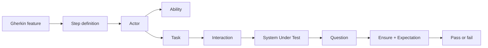

# Screenplay Flow Through The System Under Test

This document explains how the Screenplay Pattern flows through a test when it
is used to exercise an application, also known as the System Under Test (SUT).

The examples refer to this calculator project, but the flow applies to most
Screenplay-based automation projects.

## The Big Idea

Screenplay tests describe behavior from the point of view of an actor.

Instead of asking:

```text
Which test script clicks which selector and asserts which element?
```

Screenplay asks:

```text
Who is trying to achieve something, what ability do they use, what task do they
perform, and what question do they ask about the outcome?
```

That shift matters because it keeps the test close to the language of the
business while still allowing precise technical implementation underneath.

## Flow At A Glance



In this project:

- The SUT is the calculator REST API and browser UI.
- The actor is named in the Gherkin scenario, such as `Ada`.
- The abilities are `MakeRequests` for API use and `BrowseTheWeb` for browser use.
- The tasks are calculator goals, such as `Calculate.usingTheApi(...)`.
- The interactions perform mechanics, such as sending an HTTP request or filling fields.
- The questions read outcomes, such as the API result or displayed message.
- `Ensure.that(...)` checks the question against an expectation.

## Step 1: A Scenario Describes Intent

A BDD scenario starts with examples that describe observable behavior:

```gherkin
Scenario: Multiply two numbers in the browser
  When Ada calculates 8 times 6 using the browser interface
  Then the displayed result should be "8 * 6 = 48"
```

The scenario does not mention selectors, HTTP clients, response parsing, or
Playwright fixtures. That is intentional. Gherkin should express behavior the
team can discuss, not automation mechanics.

## Step 2: The Step Definition Translates Language Into Screenplay

The step definition receives the Gherkin values and creates an actor with the
right abilities:

```ts
const actor = actorWhoCanUseTheBrowser(actorName, page);
```

For API scenarios, the actor receives:

```text
MakeRequests.using(new PlaywrightApiClient(request))
ManageData.usingAnEmptyStore()
```

For UI scenarios, the actor receives:

```text
BrowseTheWeb.using(page)
ManageData.usingAnEmptyStore()
```

The step definition should stay thin. Its responsibility is translation:

```text
Gherkin phrase -> typed request -> actor performs task
```

It should not become a procedural test script.

## Step 3: The Actor Performs A Task

A task represents business intent:

```ts
Calculate.usingTheBrowser({
  leftOperand: 8,
  operator: 'multiply',
  rightOperand: 6,
});
```

The task hides the implementation sequence:

```text
remember request
open calculator
enter operands and operator
submit calculation
```

That gives the test a useful abstraction boundary. If the UI changes, the task
name can remain stable while the lower-level interactions change.

## Step 4: Interactions Operate The SUT

Interactions are the first layer that knows technical mechanics.

For the browser UI, interactions use Playwright locators:

```text
OpenTheCalculator()
EnterTheCalculation(request)
SubmitTheCalculation()
```

For the REST API, the project reuses the Screenplay library's HTTP interaction:

```text
Send.a({ method: 'POST', url: '/api/calculations', body: request })
```

This keeps mechanics isolated. A task says what the actor is trying to do; an
interaction says how the actor physically does it.

## Step 5: The SUT Responds

The SUT may respond through different interfaces:

- REST response body and status code.
- Browser DOM text.
- Future examples could include files, database records, queues, or emails.

Screenplay does not require the assertion layer to know where that response came
from. It uses questions to read the state through the actor's abilities.

## Step 6: Questions Read Outcomes

Questions describe what the actor wants to know:

```text
TheApiCalculation.result()
TheApiCalculation.errorDetails()
TheDisplayedCalculation.message()
```

The important point is that questions are named from the perspective of the
test's intent. They are not named after implementation details such as
`GetTextFromResultOutput`.

This keeps assertions readable:

```ts
Ensure.that(TheDisplayedCalculation.message(), equals('8 * 6 = 48'))
```

## Step 7: Expectations Decide Pass Or Fail

`Ensure.that(...)` resolves the question and compares it with an expectation:

```text
equals(48)
includes("Division by zero is undefined.")
```

If the expectation is not met, the Screenplay implementation throws an assertion
error and the Playwright test fails.

## The Same Flow Works For API And UI

The API scenario follows the same shape:

```mermaid
sequenceDiagram
  participant Scenario as Gherkin Scenario
  participant Step as Step Definition
  participant Actor as Actor
  participant ApiAbility as MakeRequests Ability
  participant Sut as Calculator REST API
  participant Question as API Question

  Scenario->>Step: Ada calculates 7 plus 5 using the REST API
  Step->>Actor: attemptsTo(Calculate.usingTheApi(...))
  Actor->>ApiAbility: Send POST /api/calculations
  ApiAbility->>Sut: HTTP request
  Sut-->>ApiAbility: HTTP response
  Step->>Actor: attemptsTo(Ensure.that(TheApiCalculation.result(), equals(12)))
  Actor->>Question: answer result question
  Question-->>Actor: 12
```

The UI scenario also follows the same shape:

```mermaid
sequenceDiagram
  participant Scenario as Gherkin Scenario
  participant Step as Step Definition
  participant Actor as Actor
  participant Browser as BrowseTheWeb Ability
  participant Sut as Calculator Browser UI
  participant Question as UI Question

  Scenario->>Step: Ada calculates 8 times 6 using the browser interface
  Step->>Actor: attemptsTo(Calculate.usingTheBrowser(...))
  Actor->>Browser: open page, fill fields, submit
  Browser->>Sut: user-like browser actions
  Sut-->>Browser: rendered result
  Step->>Actor: attemptsTo(Ensure.that(TheDisplayedCalculation.message(), equals(...)))
  Actor->>Question: answer displayed message question
  Question-->>Actor: 8 * 6 = 48
```

The interface changes, but the Screenplay grammar stays consistent.

## Why This Helps Test Design

Screenplay supports SOLID test automation:

- Single responsibility: abilities, interactions, tasks, and questions each have one role.
- Open/closed: add new tasks or questions without rewriting every scenario.
- Dependency inversion: tests depend on abilities and contracts, not raw framework details everywhere.

It also supports a healthy test pyramid:

- Unit tests prove calculator rules directly.
- API tests prove the REST boundary.
- BDD Screenplay tests prove business-readable examples through API and UI workflows.

The result is a test suite that teaches both application behavior and automation
architecture.

## Common Smells

Watch for these as a Screenplay project grows:

- Step definitions full of selectors or HTTP response parsing.
- Tasks named after implementation mechanics instead of user intent.
- Questions named after DOM structure instead of observable outcomes.
- Actors with too many unrelated abilities.
- BDD scenarios duplicating every unit or API test case through the browser.

When those appear, move mechanics downward into interactions or abilities, move
intent upward into tasks, and keep Gherkin focused on examples worth discussing.
